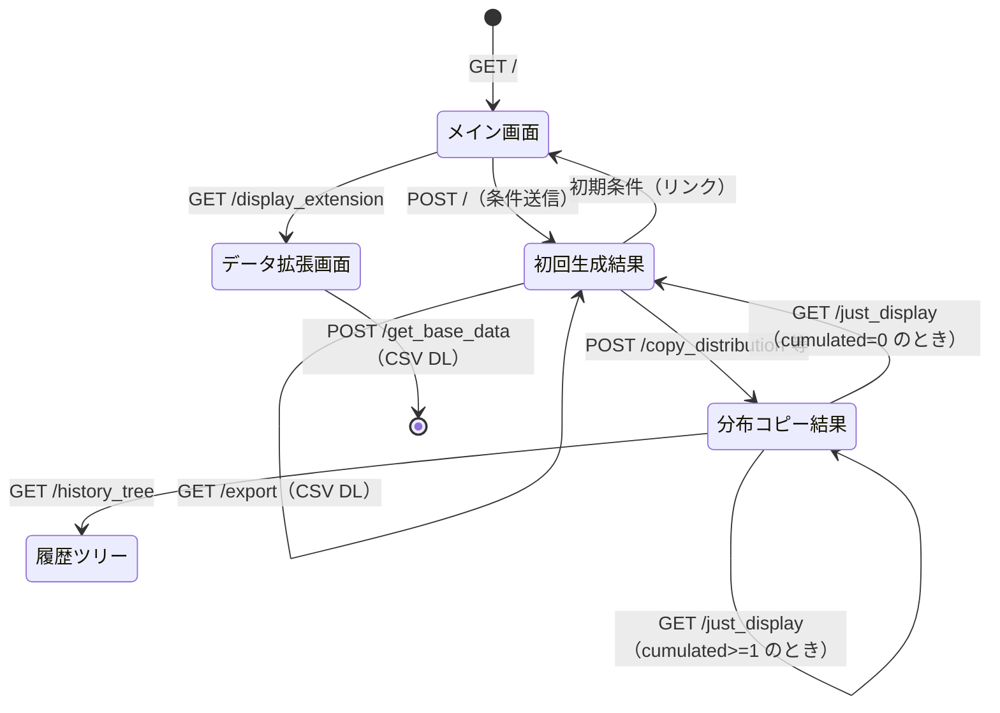
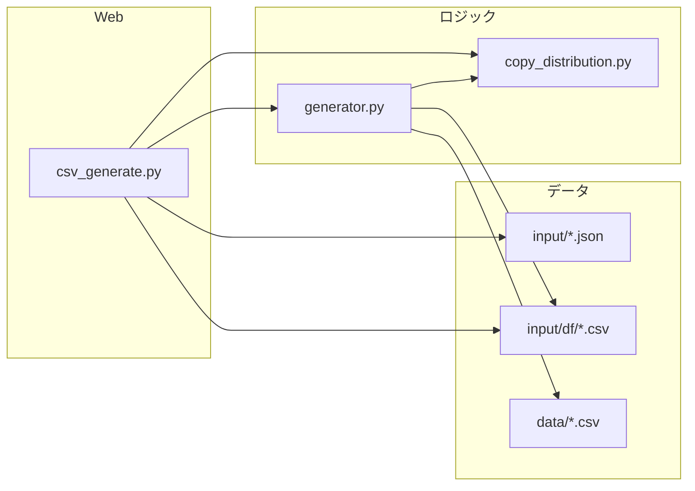

# モジュール責務マトリクス・処理順序・依存関係・ステータス遷移

Pseudo-Personal-Information-Generator プロジェクトのウォークスルーに基づく設計ドキュメント。

---

## 1. プロジェクト概要

| 項目 | 内容 |
|------|------|
| 目的 | 擬似個人情報の生成と、既存データの分布を踏まえたデータ拡張（Data Augmentation） |
| 技術 | Python, Flask, Pandas, Plotly, Faker |
| エントリポイント | `csv_generate.py`（Flask アプリ） |

---

## 2. モジュール責務マトリクス

### 2.1 Python モジュール

| モジュール | 責務 | 主な関数・処理 | 入出力 |
|------------|------|----------------|--------|
| **csv_generate.py** | Web 層。ルーティング・リクエスト受付・JSON/CSV 永続化・テンプレート描画 | `form()`, `copy_distribution_display()`, `export_action()`, `data_extension()`, `export_extended_data()` 等 | リクエスト → generator/copy_distribution 呼び出し → HTML/CSV/JSON |
| **generator.py** | 擬似個人情報生成・分布コピー・統計・画像生成・データ拡張の全ロジック | `generate_df()`, `distribution_copied_df_stablized()`, `save_image_and_return_statistics()`, `extended_generator()`, `distinction()`, `generate_extended_data()` 等 | パラメータ・DataFrame → DataFrame・統計dict・画像ファイル |
| **copy_distribution.py** | 既存データの分布に基づく「分布コピー」サンプリング | `calculate_distribution_cumulative()`, `distribution_copied_fuction()` | DataFrame + キーリスト → 累積分布・元件数 / 累積分布 → サンプル値 |

### 2.2 テンプレート（画面責務）

| テンプレート | 責務 | 表示内容・遷移先 |
|--------------|------|------------------|
| **layout.html** | 共通レイアウト（Bootstrap・スタイル） | 全画面の土台 |
| **main_screen.html** | 初期画面。生成条件入力 | 行数・年齢範囲・項目チェック・会社名年齢範囲 → POST `/` |
| **comf_basic.html** | 確認画面の土台 | テーブル表示エリアの枠 |
| **comformation.html** | 初回生成後の確認 | 生成データ一覧・年齢/血液型/性別グラフ・ダウンロード・分布類似度係数入力 → `/copy_distribution` or `/export` |
| **comf3exp.html** | 分布コピー/混合後の確認 | 元データ・コピー済みデータ・統計表・グラフ・ダウンロード・混合分布作成・履歴ツリー等 |
| **extension.html** | データ拡張画面 | CSV アップロード・行数指定 → POST `/get_base_data` |
| **history_trees.html** | 履歴ツリー画面の土台 | サイドナビ・ツリー表示ブロック |
| **tree_content.html** | ツリー内容（動的生成） | 生成履歴の親子・割合・ダウンロードリンク |

### 2.3 データ・静的リソース

| リソース | 責務 |
|----------|------|
| **data/** | 名前・郵便番号・会社名等のマスタ（first_name_sorted.csv, last_name.csv, KEN_ALL2.csv, compony_data.csv） |
| **input/df_data.json** | 現在の生成条件（行数・年齢範囲・項目・cumulated_number） |
| **input/variable_data_archived.json** | 各「dummyN」の分布アーカイブ（ages/bloods/sexes の件数リスト、child で親子・混合割合） |
| **input/df/*.csv** | 生成結果（created_dummy_new.csv, dummy1..N.csv, tdf.csv） |
| **static/figure/** | 分布グラフ画像（dummy/, d_copied_dummy/{N}/） |

---

## 3. 処理順序（フロー）

### 3.1 初回：擬似個人情報の生成

```
[ユーザー] main_screen.html で条件入力 (POST /)
    ↓
[csv_generate.form]
  1. リクエストから row, age_start, age_end, compony_start/end, info 取得
  2. input/df_data.json に保存（cumulated_number=0）
  3. input/variable_data_archived.json を空で初期化
  4. generator.create_age_list(), generator.generate_df() 呼び出し
  5. created_dummy_new.csv に保存
  6. static/figure/dummy/ に年齢・性別・血液型のグラフ画像を生成
  7. comformation.html を描画（データ一覧・グラフ・分布類似度係数フォーム）
```

### 3.2 分布類似度を指定して「同系分布」を生成

```
[ユーザー] comformation.html で「同系分布データ作成」 (POST /copy_distribution)
    ↓
[csv_generate.copy_distribution_display]
  1. df_data.json 読み込み → sent_data_to_info() でパラメータ取得
  2. cumulated_number をインクリメント → now_df_number
  3. created_dummy_new.csv を original_df として読み込み
  4. copy_distribution.calculate_distribution_cumulative() で年齢・血液型・性別の累積分布を取得
  5. generator.distribution_copied_df_stablized() で類似度係数付きの分布コピー DataFrame を生成
  6. input/df/dummy{N}.csv に保存
  7. static/figure/d_copied_dummy/{N}/ にグラフを生成
  8. generator.save_image_and_return_statistics() で統計を計算
  9. variable_data_archived.json に今回の ages/bloods/sexes を保存
  10. comf3exp.html を描画
```

### 3.3 割合指定で分布コピー（copy_distribution_by_ratio）

```
[ユーザー] 割合指定フォームから POST /copy_distribution_by_ratio
    ↓
[csv_generate.copy_distribution_by_ratio_display]
  1. df_data.json 読み込み、now_df_number 更新
  2. 年齢分布（一様/正規/ベータ/ランダム）、血液型・性別の割合をフォームから取得
  3. generator.ratio_copied_df_stablized_age_specified() で DataFrame 生成
  4. 以降は上記と同様（CSV保存・グラフ・統計・アーカイブ・comf3exp 表示）
```

### 3.4 混合分布の生成（make_mixture_distribution）

```
[ユーザー] 既存の dummy を複数選択し重みを指定 → POST /make_mixture_distribution
    ↓
[csv_generate.make_mixture_distribution]
  1. variable_data_archived.json から選択された dummy の ages/bloods/sexes を取得
  2. 重みで加重平均し、行数に合わせて整数化・端数調整
  3. generator.make_df_from_abs_box() で DataFrame 生成
  4. 今回の child（どの dummy を何割混ぜたか）をアーカイブに保存
  5. 以降は同様（CSV・グラフ・統計・comf3exp）
```

### 3.5 データ拡張（既存 CSV を元に列アルゴリズム推定して拡張）

```
[ユーザー] extension.html でベース CSV と行数を指定 → POST /get_base_data
    ↓
[csv_generate.export_extended_data]
  1. generator.extended_generator(base_df, row_num) を呼び出し
      1. generator.distinction() で列ごとのアルゴリズム判定（有限カテゴリ・分布コピー・日付単調増加等）
      2. generator.save_necessary_data() でパーセンタイル・累積比等を計算
      3. generator.generate_extended_data() で行を生成（名前・住所・年齢等の関連は generator 内で一括生成）
  2. input/df/tdf.csv に保存し、CSV をダウンロード用に返却
```

### 3.6 ダウンロード・履歴表示

- **GET /export** … created_dummy_new.csv をダウンロード
- **GET /export_copied_dummy** … 直近の dummy{cumulated_number}.csv をダウンロード
- **POST /export_dummy_by_number** … 指定番号の dummy{N}.csv をダウンロード
- **GET /just_display** … 現在の cumulated_number に応じて comformation または comf3exp を表示
- **GET /history_tree** … variable_data_archived から親子関係を組み、tree_content を動的生成して履歴ツリー表示

---

## 4. 依存関係

### 4.1 モジュール間依存（Python）

```
csv_generate.py
  ├── generator
  │     ├── copy_distribution（分布サンプリング用）
  │     └── （標準ライブラリ・pandas・plotly・faker 等）
  └── copy_distribution（累積分布計算・分布コピー1件取得）
```

- **csv_generate** は **generator** と **copy_distribution** の両方に依存する。
- **generator** は **copy_distribution** を import し、`distribution_copied_fuction` および `calculate_distribution_cumulative` を利用する。
- **copy_distribution** は generator に依存しない（generator を import しているが、copy_distribution 側の `create_age_list` 等は自前で定義されている）。

### 4.2 データ依存

| 処理 | 読むデータ | 書くデータ |
|------|------------|------------|
| 初回生成 (POST /) | data/*.csv | df_data.json, variable_data_archived.json, created_dummy_new.csv, static/figure/dummy/*.png |
| 分布コピー (POST /copy_distribution 等) | df_data.json, created_dummy_new.csv, variable_data_archived.json | df_data.json, variable_data_archived.json, dummy{N}.csv, static/figure/d_copied_dummy/{N}/*.png |
| 混合分布 (POST /make_mixture_distribution) | df_data.json, created_dummy_new.csv, variable_data_archived.json | 同上 |
| データ拡張 (POST /get_base_data) | アップロード CSV | tdf.csv |
| 履歴ツリー (GET /history_tree) | df_data.json, variable_data_archived.json | （tree_content を動的生成するが、ファイルに書くのは tree_content.html の上書きのみ） |

---

## 5. ステータス遷移

### 5.1 画面（ビュー）の状態遷移

```
                    GET /
            ┌───────────────────┐
            │  main_screen      │ 初期条件入力
            └─────────┬─────────┘
                      │ POST /（条件送信）
                      ▼
            ┌───────────────────┐
            │  comformation     │ 初回生成結果・グラフ・分布係数入力
            └───┬───────────┬───┘
                │           │
    GET /export │           │ POST /copy_distribution
    (DL CSV)    │           │ or /copy_distribution_by_ratio
                │           │ or /make_mixture_distribution
                │           ▼
                │   ┌───────────────────┐
                │   │  comf3exp         │ 分布コピー/混合結果・統計・DL・混合作成
                │   └───┬───────────┬───┘
                │       │           │
                │       │ GET /history_tree
                │       │ GET /just_display
                │       ▼           ▼
                │   ┌───────────┐ ┌─────────────────┐
                │   │history_   │ │ comformation or  │
                │   │trees /    │ │ comf3exp（再表示）│
                │   │tree_content│ └─────────────────┘
                │   └───────────┘
                │
                └───────────────────────────────────────► CSV ダウンロード（画面遷移なし）

GET /display_extension
            ┌───────────────────┐
            │  extension        │ ベースCSV＋行数
            └─────────┬─────────┘
                      │ POST /get_base_data
                      ▼
                  CSV ダウンロード（tdf.csv）
```

### 5.2 データ状態（セッション的状態）

- **cumulated_number**（df_data.json）  
  - 0：初回生成のみ済み。  
  - 1 以上：分布コピーまたは混合を 1 回以上実行済み。`dummy1.csv` ～ `dummy{cumulated_number}.csv` と `variable_data_archived` が対応。

- **variable_data_archived**  
  - キー `"1"` ～ `"{cumulated_number}"` それぞれに、その回の `ages`, `bloods`, `sexes` と、混合の場合は `child`（親 dummy 番号 → 割合）を保持。  
  - 履歴ツリーはこの `child` から親子関係を復元。

### 5.3 処理ステータス（簡易）

| 状態 | 条件 | 利用可能な操作例 |
|------|------|------------------|
| 未生成 | 初回アクセス | POST / で条件送信のみ |
| 初回生成済み | cumulated_number == 0, created_dummy_new.csv あり | ダウンロード、分布係数入力→同系分布作成、割合指定、拡張画面へ |
| 分布コピー/混合済み | cumulated_number >= 1 | 直近 dummy の DL、番号指定 DL、混合分布作成、履歴ツリー、just_display |

### 5.4 ステータス遷移図（Mermaid）



### 5.5 モジュール依存関係図（Mermaid）



---

## 6. ファイル構成と責務の対応

```
pseudo-personal-information-generator/
├── csv_generate.py      # Web 層・ルーティング・永続化
├── generator.py         # 生成・分布コピー・統計・拡張ロジック
├── copy_distribution.py # 分布の累積計算とサンプリング
├── data/                # マスタ CSV
├── input/
│   ├── df_data.json
│   ├── variable_data_archived.json
│   └── df/*.csv
├── static/figure/       # グラフ画像
├── templates/           # 画面テンプレート
├── Makefile             # git-push 等
└── docs/
    └── module-responsibility-matrix.md  # 本ドキュメント
```

---

以上が、モジュール責務マトリクス・処理順序・依存関係・ステータス遷移のまとめである。
